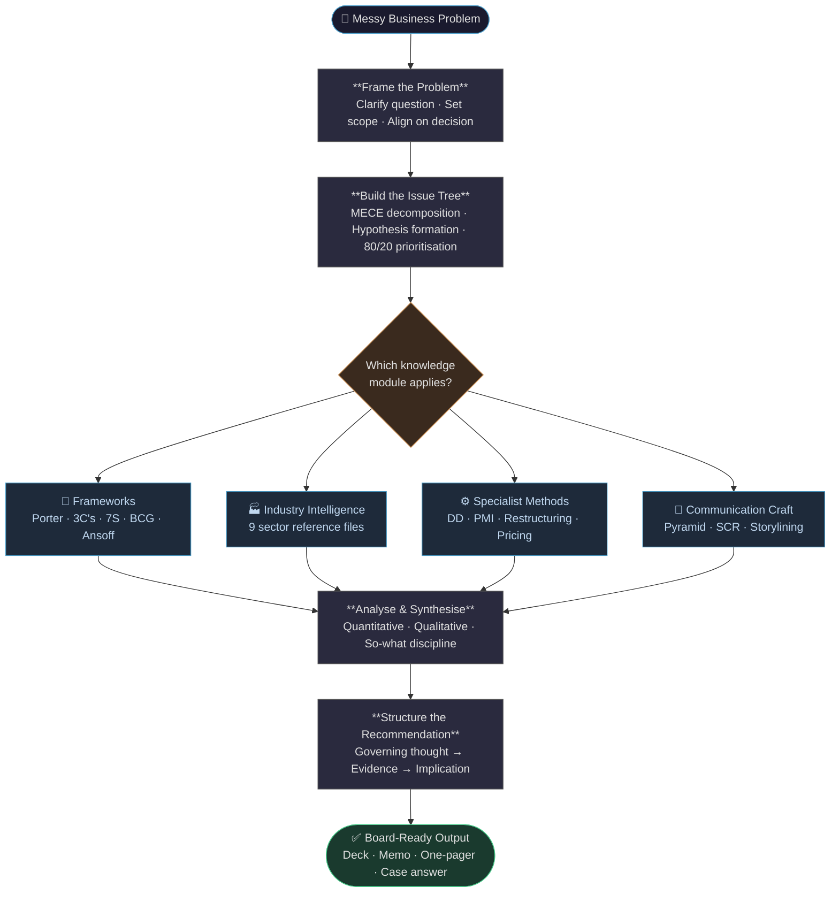
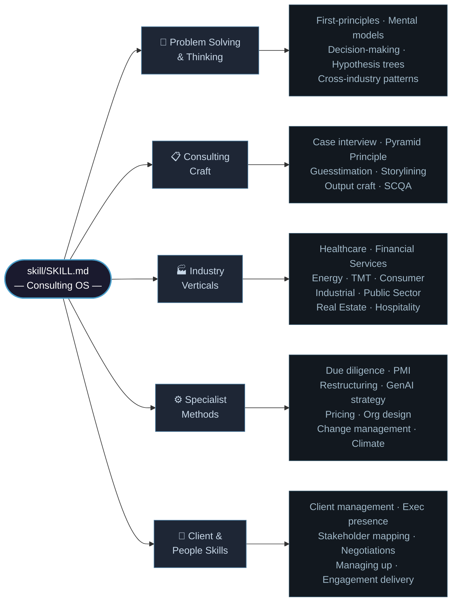

# MBB Management Consultant AI Skill for Claude

> A free, open-source consulting knowledge base for Claude, built to help students, MBA candidates, and early-career professionals think more clearly, prep for case interviews, and apply consulting frameworks practically.

[](https://opensource.org/licenses/MIT)
[](https://claude.ai)
[]()
[]()
[](https://github.com/sponsors/DogInfantry)

---

**TL;DR:** Install this skill to give Claude a structured consulting workflow, useful for case prep, framework practice, or thinking through real business problems. Free, open-source, contributions welcome.

---

## What This Is

This repository contains a consulting knowledge base for [Claude](https://claude.ai), Anthropic's AI assistant. When installed, it gives Claude a structured senior-consultant workflow, built around MBB-style problem-solving and communication patterns built by distilling publicly available MBB frameworks, case prep resources, and consulting methodology into a single knowledge base.

This is not a simple prompt. It is a structured knowledge system with 110+ reference files covering every dimension of consulting work, from MECE issue trees and Pyramid Principle communication to due diligence, post-merger integration, GenAI enterprise strategy, and case interview coaching.

**It is completely free.**

---

## How It Works

Every problem flows through the same consulting operating system — structured, hypothesis-driven, and board-ready at the end.



---

## Knowledge Architecture

The skill draws from 110+ reference files organised across five layers.



---

## Knowledge Sources & IP Notice

This project contains **no proprietary, confidential, or insider material** from any consulting firm or client engagement. Everything here is derived from publicly available sources only.

**What this knowledge base is built from:**

- 📚 **Published books** — *The McKinsey Way*, *Bulletproof Problem Solving*, *The Pyramid Principle* (Barbara Minto), *Case in Point*, *Competitive Strategy* (Porter), *Good Strategy Bad Strategy*, and other widely available texts
- 🌐 **Firms' own public content** — McKinsey Insights, BCG Henderson Institute, Bain & Company articles, Deloitte Insights, PwC Strategy& reports — all publicly accessible
- 🎓 **Case prep platforms** — Victor Cheng's *Case Interview Secrets*, PrepLounge, CaseCoach, IGotAnOffer, and MBB-published practice case books
- 📊 **Public industry data** — SEC filings, World Bank, IMF, IEA, CMS, FDA, Bloomberg public datasets, and industry association benchmarks
- 🏫 **Academic and business school material** — HBS, Wharton, INSEAD case abstracts and publicly released teaching notes
- 🔓 **Open-source consulting frameworks** — Porter's Five Forces, BCG Growth-Share Matrix, McKinsey 7-S, Ansoff Matrix, and others that have been in the public domain for decades

**What this knowledge base does NOT contain:**

- ❌ No client names, engagement details, or project-specific data
- ❌ No internal firm templates, proprietary scoring rubrics, or methodology documents obtained under NDA
- ❌ No unpublished research, pre-release reports, or confidential benchmarks
- ❌ No content obtained through employment at or breach of agreement with any firm
- ❌ No leaked internal documents of any kind

Use of terms like "McKinsey-style" or "MBB" throughout this repo is purely descriptive — referring to a publicly understood standard of consulting practice, not a claim of affiliation or endorsement by any firm.

If you are a current or former consultant and wish to contribute, please ensure any additions follow these same standards: public sources only, no client data, no confidential firm IP.

---

## Who This Is For

| Audience | How You Benefit |
|----------|----------------|
| **MBA students and candidates** | Practice case interviews, learn consulting frameworks, build structured thinking from scratch |
| **MBB / Big 4 consultants** | Faster decks, sharper issue trees, better synthesis |
| **Business professionals** | Apply consulting-grade thinking to real problems without hiring a firm |
| **Founders and operators** | Structure strategy, diagnose profitability issues, build board-ready narratives |
| **AI / Claude enthusiasts** | Fork, extend, and build your own specialist skills on top of this architecture |
| **Students and academics** | Learn how high-performance problem-solvers actually think |

---

## What's Inside

```
management-consultant-claude-skill/
├── README.md                    <- You are here
├── INSTALL.md                   <- Step-by-step setup guide
├── FRAMEWORKS.md                <- Complete consulting frameworks reference
├── CASE-STUDIES.md              <- 3 worked case examples with full solutions
│
└── skill/
    ├── SKILL.md                 <- The main skill definition (install this)
    └── references/              <- 110+ deep-knowledge reference files
        ├── frameworks.md
        ├── case-interview.md
        ├── guesstimation.md
        ├── issue-hypothesis-trees.md
        ├── storylining.md
        ├── pyramid-to-diamond.md
        ├── healthcare-life-sciences.md
        ├── financial-services.md
        ├── genai-enterprise-strategy.md
        ├── post-merger-integration.md
        ├── corporate-restructuring-financial-distress.md
        └── ... 100+ more
```

---

## Capabilities

Once installed, Claude can assist you with:

### Strategic Problem-Solving
- **MECE issue trees**: decompose any problem into mutually exclusive, collectively exhaustive branches
- **Hypothesis-driven analysis**: start with a point of view, test it with evidence
- **80/20 prioritization**: focus on the 20% of drivers that create 80% of impact
- **First-principles thinking**: break assumptions, reason from fundamentals

### Consulting Frameworks (Full Toolkit)
- Porter's Five Forces, 3C's, McKinsey 7-S, Ansoff Matrix, BCG Growth-Share
- Value Chain Analysis, Blue Ocean Strategy, GE-McKinsey 9-Box
- PESTEL, TAM/SAM/SOM, STP, Jobs-to-Be-Done
- DuPont Analysis, Unit Economics (CAC/LTV), DCF basics
- Profitability frameworks, Kotter's 8 Steps, RACI, Three Horizons

### Case Interview Coaching
- Full McKinsey / Bain / BCG case formats
- Practice cases across all case types (profitability, market entry, M&A, pricing, growth)
- Scoring rubrics and structured feedback
- PEI (Personal Experience Interview) preparation with STAR coaching
- Math and estimation drills

### Communication and Deliverables
- **Pyramid Principle**: lead with the answer, support with evidence
- **SCR structure**: Situation, Complication, Resolution
- Executive-grade slide action titles, memos, one-pagers
- Storylining: from 200 facts to 5 messages with a red thread
- Communication under pressure, hostile Q&A, executive presence

### Industry Reference Files
- Healthcare and Life Sciences (hospital P&L, pharma pipeline, FDA, CMS)
- Financial Services (NIM, ROE, Basel IV, insurance, fintech)
- Energy and Utilities (LCOE, IRA, energy transition, FERC)
- Technology, Media and Telecom (SaaS unit economics, platform dynamics, 5G)
- Consumer, Retail and CPG (GMROI, trade spend, DTC disruption)
- Industrial and Manufacturing (OEE, Lean/TPS, S&OP, Industry 4.0)
- Public Sector and Defense (FAR/DFARS, GovCon, IDIQ)
- Real Estate and Infrastructure (cap rates, NOI, REPE, REIT)
- Hospitality and Travel (RevPAR, ADR, airline CASK)

### Specialist Methods
- Due diligence (commercial, operational, financial, ESG)
- Post-merger integration (IMO, synergy framework, Day 1 readiness)
- Corporate restructuring and financial distress (Chapter 11, DIP, 13-week cash flow)
- GenAI enterprise strategy (pilot purgatory, RAG, LLMOps, EU AI Act)
- Pricing and revenue management (conjoint, Van Westendorp, price waterfall)
- Org design and workforce planning (Galbraith Star, spans and layers, SBO)
- Change management (ADKAR, Kotter, resistance management)
- Climate strategy and net-zero (SBTi, MAC curves, CSRD, CBAM)
- Process mining (Celonis, Signavio, conformance checking)
- Sales force effectiveness (quota setting, coverage models, CRM analytics)
- McKinsey 7-step problem-solving methodology and day-one answer discipline
- Hypothesis invalidation and structured pre-mortem thinking
- Cost restructuring anatomy (zero-based, complexity reduction, shared services)
- Transformation program architecture (wave planning, governance, benefits tracking)
- Executive presence in senior rooms, board communication and decision-support
- Technology vendor selection and evaluation frameworks
- Synergy modeling and validation (revenue, cost, financial)
- Behavioral change design and insight-to-action translation
- Client political mapping, scope creep governance, and consulting negotiation

---

## Quick Start

### 1. Get Claude
You need access to [Claude](https://claude.ai). Free tier works; Pro is recommended for heavy use.

### 2. Install the Skill
See **[INSTALL.md](./INSTALL.md)** for the full setup guide. The short version:

1. Download `skill/SKILL.md` and the entire `skill/references/` folder
2. Follow the Cowork/Claude Code installation steps in `INSTALL.md`
3. Start a new conversation and type: *"Act as my management consultant"*

### 3. Try These Prompts
```
"Help me structure a profitability analysis for a $500M retail chain whose margins have been declining."

"I have a case interview at McKinsey next week. Run me through a market entry case."

"Size the US electric vehicle charging market from first principles."

"My company is considering acquiring a SaaS competitor. Build me an M&A issue tree."

"Write me an executive summary for a cost reduction initiative in the logistics function."

"I need to present a go-to-market strategy to the board. Help me structure the narrative."
```

---

## For Case Interview and Competition Prep

This skill is built for active practice, not just passive reading.

**For case interview prep:**
- Ask Claude to run you through a case as an interviewer (McKinsey-led, BCG candidate-led, Bain collaborative)
- Get scored on structure, hypothesis, quant, synthesis, and recommendation
- Practice market sizing, profitability, market entry, M&A, pricing across all formats
- Drill behavioral / PEI stories with real-time STAR coaching

**For case competitions:**
- Use Claude to stress-test your team's issue tree before the presentation
- Get a second opinion on your recommendation and the risks you may have missed
- Sanity-check your market sizing assumptions and financial math
- Sharpen your slide action titles and executive narrative

**For self-study and groundwork:**
- Work through the 3 case studies in [CASE-STUDIES.md](./CASE-STUDIES.md) before attempting live cases
- Use [FRAMEWORKS.md](./FRAMEWORKS.md) as your active reference, not just a read-once guide
- Build the habit of structuring every problem MECE before answering

```
"Run me through a McKinsey-style profitability case. Play the interviewer."

"Score my structure on this market entry case on a 1-4 scale across all dimensions."

"My case comp team has 48 hours. Help us stress-test our recommendation."

"Give me 10 market sizing questions and coach me through each one."
```

---

## The Consulting Mindset

Top consultants operate with a specific cognitive architecture that most people are never explicitly taught:

- They lead with the answer, not the analysis
- They think in structures, not lists
- They form hypotheses before gathering data, not after
- They apply 80/20 thinking ruthlessly
- They communicate in pyramids: governing thought, then evidence

This skill is a scaffold for building those habits. It is not a replacement for judgment, but a way to practice the patterns consistently.

---

## Frameworks Quick Reference

See **[FRAMEWORKS.md](./FRAMEWORKS.md)** for the complete reference. Highlights:

| Problem | Framework |
|---------|-----------|
| Why is profit declining? | Profitability tree, DuPont, Value chain |
| Should we enter market X? | 3C's + Market sizing, Porter's Five Forces |
| How to grow revenue 20%? | Ansoff Matrix + Solution issue tree |
| Should we acquire Company Y? | 3C's + Synergy analysis + DCF |
| How to optimize operations? | Lean / Value stream, DMAIC |
| How to build a strategy? | Porter's Five Forces + 3C's + Blue Ocean |
| How to restructure the org? | 7S + Kotter + RACI + Talent 9-Box |
| How to price a new product? | Value-based pricing + Competitive positioning |

---

## Case Studies

See **[CASE-STUDIES.md](./CASE-STUDIES.md)** for 3 fully worked cases. Each includes: full interviewer prompt → candidate structure → key analyses → final recommendation.

| Case | Type | Setup | What You'll Practice |
|------|------|-------|----------------------|
| **The Falling Star** | Profitability | $800M specialty beverage company, margins declining 3 years running | Issue tree, cost/revenue disaggregation, root cause identification |
| **New Frontier** | Market Entry | European athletic apparel brand evaluating US expansion | Market sizing, 3C's, entry mode selection, go/no-go recommendation |
| **The Big Question** | Market Sizing | PE fund sizing the US pet insurance market for acquisition due diligence | Bottom-up sizing, TAM/SAM/SOM, assumption stress-testing |

*A PE / LBO case is in progress — see [Issue #6](https://github.com/DogInfantry/claude-skill-management-consultant-B1/issues/6) if you'd like to contribute it.*

---

## Contributing

This is a living knowledge base — the more industries, benchmarks, and cases it covers, the more useful it becomes for everyone.

**See [CONTRIBUTING.md](./CONTRIBUTING.md)** for the full guide: file structure, quality bar, and how to submit a PR.

**Open issues (good places to start):**
- [Add reference file: Cybersecurity Consulting](https://github.com/DogInfantry/claude-skill-management-consultant-B1/issues/3)
- [Add reference file: Education & EdTech](https://github.com/DogInfantry/claude-skill-management-consultant-B1/issues/4)
- [Update benchmarks: genai-enterprise-strategy.md](https://github.com/DogInfantry/claude-skill-management-consultant-B1/issues/5)
- [Add case study: PE / LBO case](https://github.com/DogInfantry/claude-skill-management-consultant-B1/issues/6)
- [Add reference file: Semiconductor & Hardware](https://github.com/DogInfantry/claude-skill-management-consultant-B1/issues/7)

You don't need to be ex-MBB to contribute. If you've worked in any industry, finance role, or ops team, you have something concrete to add.

---

## Support This Project

This skill is free and always will be. If it helped you land an interview, ace a case, or think more clearly about a hard problem, here are a few ways to give back:

- ⭐ **[Star the repo](https://github.com/DogInfantry/claude-skill-management-consultant-B1)** — helps others find it
- 💖 **[Sponsor on GitHub](https://github.com/sponsors/DogInfantry)** — directly support ongoing development
- ☕ **Buy me a coffee** — [ko-fi.com/doginfantry](https://ko-fi.com/doginfantry) *(set this up at ko-fi.com if you haven't yet)*
- 🔁 **Share it** with someone preparing for consulting interviews or working through a strategy problem
- 🛠️ **[Contribute](./CONTRIBUTING.md)** a case study, framework, or industry reference file

> Built for free, meant to stay free. Any support goes directly toward keeping this knowledge base current and growing.

---

## License

MIT License. Free to use, fork, adapt, and distribute. See `LICENSE` for details.

---

*Pass it on.*
